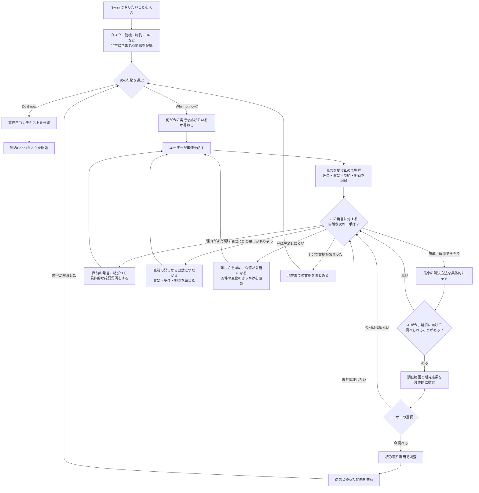

# WhyNotNow dialogue design

## Purpose

WhyNotNow helps a user understand a deferred task through a natural dialogue.
The goal is not to collect a list of reasons.  Each response should deepen the
user's understanding of the task, its context, and the conditions under which
it becomes worth doing.

The conversation may surface a small, bounded obstacle that the assistant can
help resolve.  Offer that help only when it is concrete and useful; do not
turn every reason into a research request.

## Flow

This diagram covers accepted choices in the main dialogue. If the initial
action form is cancelled, the separate cancellation follow-up handles optional
additional research or ending the conversation.

## Safety boundary

- A `$wnn` invocation records a task as deferred; it never starts the task.
- The assistant may do read-only research only after the user explicitly
  accepts a concrete research offer.
- The assistant may start the underlying task only after the user explicitly
  chooses **Do it now**.
- Persist structured understanding, not chat transcripts or private reasoning.

## Conversation policy

After every substantive user message, first update the structured
understanding.  Then respond to the latest point and choose exactly one next
move:

| Move | Use when | Response shape |
| --- | --- | --- |
| `assist` | A specific obstacle has a small, credible, read-only next step. | Explain the bounded help and ask whether to do it now. |
| `deepen` | The latest point is ambiguous or has an important missing condition. | Ask one question about that same point. |
| `connect` | The latest point naturally implies a related background, priority, desired outcome, or constraint. | State the connection and ask one related question. |
| `summarize` | The current thread is sufficiently understood, or no useful question remains. | Reflect the understanding and offer the appropriate decision or a user-led continuation. |

Do not use these moves as a fixed sequence.  Choose the one that best follows
from the user's latest message and the current structured understanding.

## Questioning rules

- Ask at most one central question in a response.
- Tie every follow-up question to the immediately preceding user statement.
- Prefer a question that clarifies a causal link, condition, trade-off, or
  desired outcome over a request for another item in a list.
- Do not ask “Are there any other reasons?” or an equivalent generic prompt.
- Do not ask about a topic that is already understood unless new information
  makes it relevant again.
- Stop asking questions once the current thread is understood.  Summarize or
  present the next decision instead.

## Assistance offers

An assistance offer must name all of the following before seeking consent:

1. the obstacle it addresses;
2. the smallest proposed scope; and
3. the expected result or remaining limitation.

For example:

> If the uncertainty is whether the tool supports your environment, I can
> check its official requirements and summarize only the compatibility result.
> Would you like me to do that now?

If the user declines, retain the current context and choose the next natural
move.  Do not automatically ask for another reason or end the conversation.

## Examples

### Deepen the current point

User: “It seems like it will take too long.”

Assistant: “Is the concern mainly the amount of work, or that it is not clear
what ‘done’ would look like?”

### Connect to an adjacent point

User: “I do not know how to use it effectively.”

Assistant: “That sounds less like a lack of interest than uncertainty about a
use case.  What would it need to help you accomplish in your own work?”

### Offer bounded assistance

User: “I am not sure whether it works with our current setup.”

Assistant: “I can check the official compatibility requirements for the
current setup and identify any mismatch.  Would you like me to do that now?”

### Summarize instead of extending the list

User: “It would be useful eventually, but it is not urgent and the setup is
still unclear.”

Assistant: “So the value is real, but the immediate priority and a clear
starting point are missing.  Keeping this deferred until either changes seems
reasonable.”

## Acceptance scenarios

Use these scenarios to review a release manually:

1. A time-related concern is explored through workload or completion
   conditions, not by asking for another reason.
2. A concrete compatibility or documentation gap produces one specific
   read-only assistance offer.
3. A priority concern is acknowledged and connected to a future review
   condition, without trying to force a solution.
4. Declining assistance leaves the assistant in the current conversation
   context rather than a generic reason-collection loop.
5. Once a thread is understood, the assistant summarizes instead of continuing
   to question the user.
6. The underlying task is not inspected, modified, or started before **Do it
   now** is explicitly selected.
