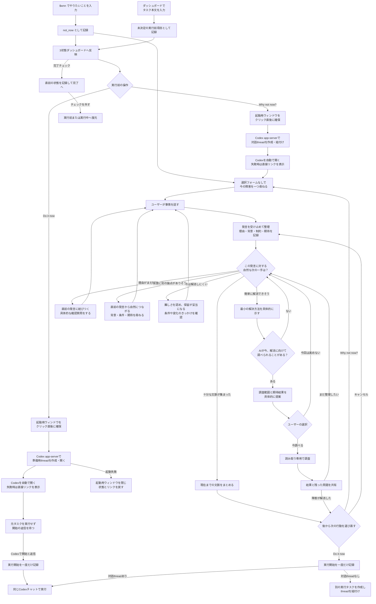

# WhyNotNow の対話フローチャート

この図は主要な対話フローを視覚的に示したものです。対応するポリシーと詳しい動作は、[対話設計](dialogue-design.md) を参照してください。

MCP による会話の読み書き結果はアシスタント向けに渡され、ユーザー向けの対話には JSON を表示しません。保存に失敗した場合だけ、通常の短いエラーメッセージを表示します。

```mermaid
flowchart TD
    A["$wnn でやりたいことを入力"] --> B["not_now として記録"]
    B --> D["選択フォームなしで<br/>今の障害を一つ尋ねる"]
    AA["ダッシュボードで<br/>タスク本文を入力"] --> AB["未決定の実行前項目として記録"]

    B --> T["3状態ダッシュボードへ反映"]
    AB --> T
    T --> U{"実行前の操作"}
    U -->|"Why not now?"| WO["起動用ウィンドウを<br/>クリック直後に確保"]
    WO --> W["Codex app-serverで<br/>対話threadを作成・紐付け"]
    W --> WL["Codexを自動で開く<br/>失敗時は直接リンクを表示"]
    WL --> D
    U -->|"Do it now"| XO["起動用ウィンドウを<br/>クリック直後に確保"]
    XO --> X["Codex app-serverで<br/>準備用threadを作成・開く"]
    X --> XL["Codexを自動で開く<br/>失敗時は直接リンクを表示"]
    XL --> XW["元タスクを実行せず<br/>開始の返信を待つ"]
    XW -->|"Codexで開始と返信"| X2["実行開始を一度だけ記録"]
    X2 --> Y["同じCodexチャットで実行"]
    X -->|"起動失敗"| XC["起動用ウィンドウを閉じ<br/>状態とリンクを戻す"]

    T -->|"完了チェック"| V["直前の状態を記録して完了へ"]
    V -->|"チェックを外す"| VR["実行前または実行中へ復元"]

    D --> E["ユーザーが事情を話す"]
    E --> F["発言を受け止めて整理<br/>理由・背景・制約・期待を記録"]
    F --> G{"この発言に対する<br/>自然な次の一手は？"}

    G -->|"簡単に解消できそう"| H["最小の解決方法を具体的に示す"]
    H --> I{"AIが今、解消に向けて<br/>調べられることがある？"}
    I -->|"ある"| J["調査範囲と期待結果を<br/>具体的に提案"]
    J --> K{"ユーザーの選択"}
    K -->|"今調べる"| L["読み取り専用で調査"]
    L --> M["結果と残った問題を共有"]
    K -->|"今回は進めない"| G
    I -->|"ない"| G

    G -->|"理由がまだ曖昧"| Q["直前の発言に結びつく<br/>具体的な確認質問をする"]
    Q --> E

    G -->|"背景に別の論点がありそう"| R["直前の発言から自然につながる<br/>背景・条件・期待を尋ねる"]
    R --> E

    G -->|"今は解消しにくい"| S["難しさを認め、保留が妥当になる<br/>条件や変化のきっかけを確認"]
    S --> E

    G -->|"十分な文脈が集まった"| P["現在までの文脈をまとめる"]
    P --> C{"後から次の行動を選び直す"}
    C -->|"Do it now"| X3["実行開始を一度だけ記録"]
    X3 -->|"対話threadあり"| Y
    X3 -->|"対話threadなし"| Y2["別の実行タスクを作成し<br/>threadを紐付け"]
    C -->|"Why not now?"| D
    C -->|"キャンセル"| F

    M -->|"まだ整理したい"| G
    M -->|"障害が解消した"| C
```
