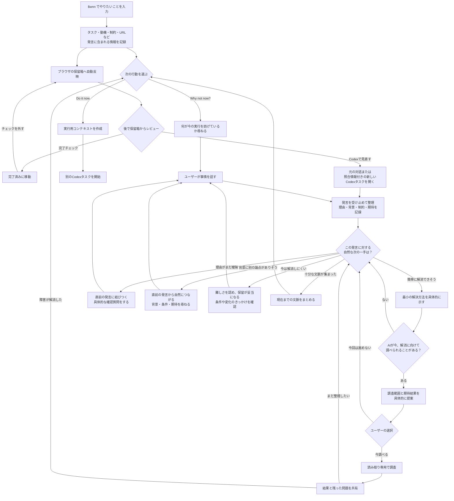

# WhyNotNow dialogue flowchart

This diagram is the visual reference for the main dialogue flow. For the
corresponding policy and detailed behavior, see
[the dialogue design](dialogue-design.md).

```mermaid
flowchart TD
    A["$wnn でやりたいことを入力"] --> B["タスク・動機・制約・URLなど<br/>発言に含まれる情報を記録"]
    B --> C{"次の行動を選ぶ"}
    B --> T["ブラウザの保留箱へ自動反映"]

    T --> U{"後で保留箱からレビュー"}
    U -->|"完了チェック"| V["完了済みに移動"]
    V -->|"チェックを外す"| T
    U -->|"Codexで見直す"| W["元の対話または<br/>照合情報付きの新しいCodexタスクを開く"]
    W --> F

    C -->|"Do it now"| X["実行用コンテキストを作成"]
    X --> Y["別のCodexタスクを開始"]

    C -->|"Why not now?"| D["何が今の実行を妨げているか尋ねる"]
    D --> E["ユーザーが事情を話す"]
    E --> F["発言を受け止めて整理<br/>理由・背景・制約・期待を記録"]
    F --> G{"この発言に対する<br/>自然な次の一手は？"}

    G -->|"簡単に解消できそう"| H["最小の解決方法を具体的に示す"]
    H --> I{"AIが今、解消に向けて<br/>調べられることがある？"}
    I -->|"ある"| J["調査範囲と期待結果を<br/>具体的に提案"]
    J --> K{"ユーザーの選択"}
    K -->|"今調べる"| L["読み取り専用で調査"]
    L --> M["結果と残った問題を共有"]
    K -->|"今回は進めない"| G
    I -->|"ない"| G

    G -->|"理由がまだ曖昧"| Q["直前の発言に結びつく<br/>具体的な確認質問をする"]
    Q --> E

    G -->|"背景に別の論点がありそう"| R["直前の発言から自然につながる<br/>背景・条件・期待を尋ねる"]
    R --> E

    G -->|"今は解消しにくい"| S["難しさを認め、保留が妥当になる<br/>条件や変化のきっかけを確認"]
    S --> E

    G -->|"十分な文脈が集まった"| P["現在までの文脈をまとめる"]
    P --> C

    M -->|"まだ整理したい"| G
    M -->|"障害が解消した"| C
```
