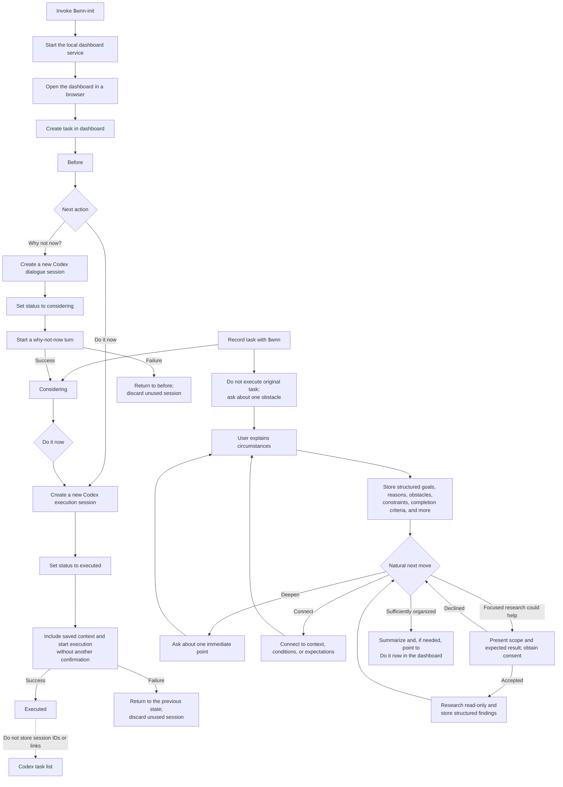

# WhyNotNow dialogue flowchart

This diagram shows the dashboard's three states and the two kinds of Codex sessions. For detailed conversation guidance, see [Dialogue design](dialogue-design.md).

The `codex://` URL returned by the dashboard is used only as a temporary handoff when launching; it is not included in stored fields or list APIs.
