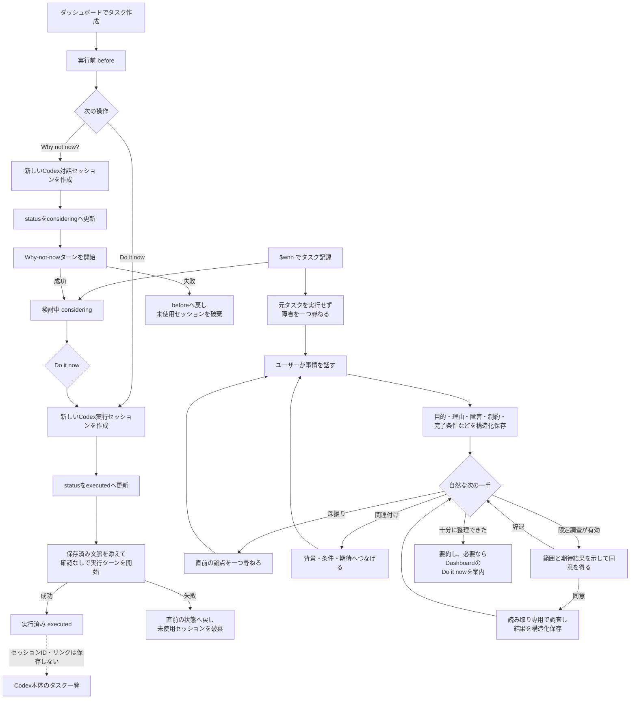

# WhyNotNow の対話フローチャート

この図は、ダッシュボードの3状態と2種類のCodexセッションを示します。詳しい対話方針は [対話設計](dialogue-design-ja.md) を参照してください。

```mermaid
flowchart TD
    A["ダッシュボードでタスク作成"] --> B["実行前 before"]
    C["$wnn でタスク記録"] --> D["検討中 considering"]
    C --> Q["元タスクを実行せず<br/>障害を一つ尋ねる"]

    B --> E{"次の操作"}
    E -->|"Why not now?"| F["新しいCodex対話セッションを作成"]
    F --> G["statusをconsideringへ更新"]
    G --> H["Why-not-nowターンを開始"]
    H -->|"成功"| D
    H -->|"失敗"| R1["beforeへ戻し<br/>未使用セッションを破棄"]

    E -->|"Do it now"| I["新しいCodex実行セッションを作成"]
    D --> J{"Do it now"}
    J --> I
    I --> K["statusをexecutedへ更新"]
    K --> L["保存済み文脈を添えて<br/>確認なしで実行ターンを開始"]
    L -->|"成功"| M["実行済み executed"]
    L -->|"失敗"| R2["直前の状態へ戻し<br/>未使用セッションを破棄"]

    Q --> N["ユーザーが事情を話す"]
    N --> O["目的・理由・障害・制約・<br/>完了条件などを構造化保存"]
    O --> P{"自然な次の一手"}
    P -->|"深掘り"| Q2["直前の論点を一つ尋ねる"]
    Q2 --> N
    P -->|"関連付け"| Q3["背景・条件・期待へつなげる"]
    Q3 --> N
    P -->|"限定調査が有効"| S["範囲と期待結果を示して同意を得る"]
    S -->|"同意"| T["読み取り専用で調査し<br/>結果を構造化保存"]
    T --> P
    S -->|"辞退"| P
    P -->|"十分に整理できた"| U["要約し、必要ならDashboardの<br/>Do it nowを案内"]

    M -. "セッションID・リンクは保存しない" .-> V["Codex本体のタスク一覧"]
```

ダッシュボードが返す `codex://` URLは起動時の一時的な引き渡しにだけ使い、保存項目や一覧APIには含めません。
